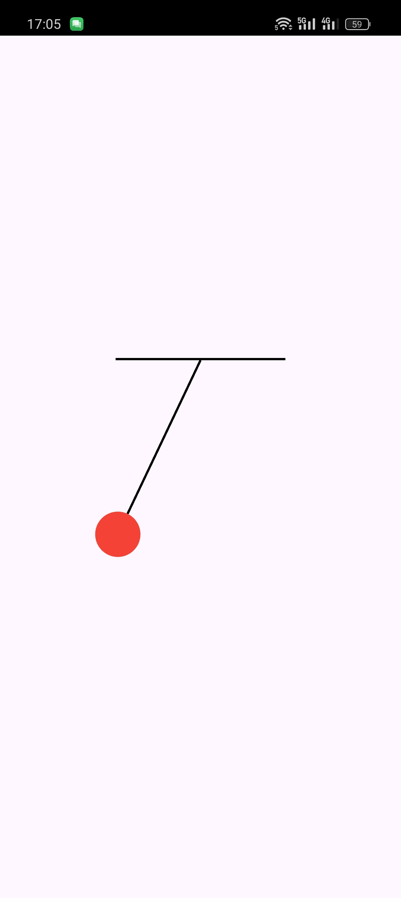

# pendulum

A Pendulum project.

### Cách giải quyết bài toán
- Lần 1: 
    - Vấn đề hỏi ChatGPT: Tạo animation con lắc đơn
    - Cài đặt package flutter_hooks để tạo animation 
    - Dùng Tween Animation để tạo góc cho con lắc đơn (góc: -pi/6 đến pi/6)
    - Dùng CurvesAnimation để tạo animation cho con lắc và dùng AnimationController để điều chỉnh lặp lại animation
    - KẾT QUẢ: Mô phỏng được chuyển động của con lắc đơn nhưng chưa đúng với thực tế: con lắc lắc theo 1 tốc độ và góc cố định, không có tốc độ giảm dần
- Lần 2: 
    - Vấn đề hỏi ChatGPT: Thay đổi góc dao động của con lắc theo thời gian
    - Không dùng Tween Animation mà chỉ dùng AnimationController để lặp lại animation
    - Sử dụng công thức vật lý dao động con lắc đơn để tính góc dao động theo thời gian 
    - AnimationController sẽ cập nhật góc dao động theo thời gian cho con lắc
    - KẾT QUẢ: Mô phỏng được chuyển động con lắc đơn theo thời gian (có tốc độ giảm dần)
### Kết quả bài toán
