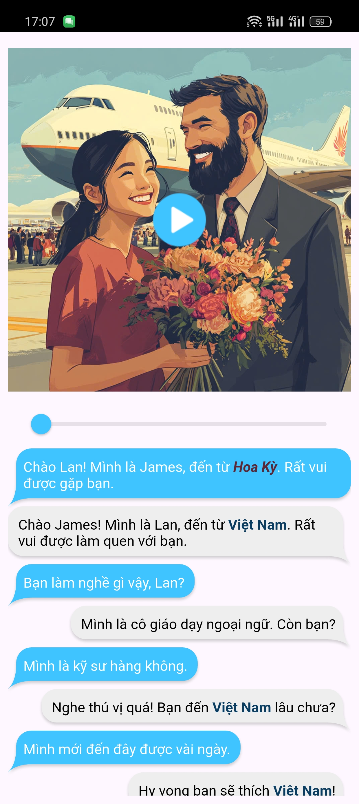
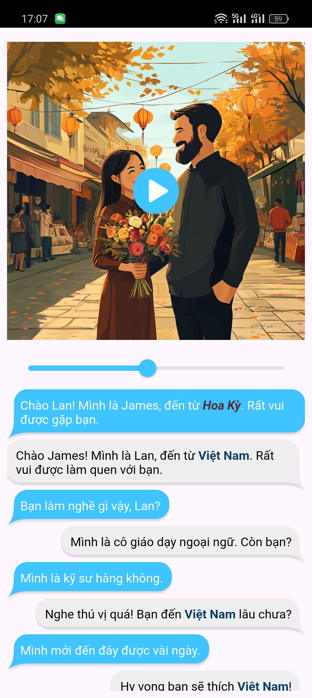

# auido_book

A Audio Book project.

### Cách giải quyết bài toán
- Lần 1: 
    - Vấn đề hỏi ChatGPT: 
        - Cách phát file audio
        - Package nào dùng để hiển thị chatting message
    - Sử dụng package audioplayers để phát file audio
    - Tạo class MyDialog để lưu dữ liệu là speaker và text từ data dialog trong file output.toml
    - Sử dụng package chat_bubbles và listview để hiển thị chatting message giữa Lan và James 
    - Hiển thị ảnh james-say-hello-to-lan
    - KẾT QUẢ: Phát file audio khi vừa vào app và hiển thị chatting message giữa 2 người (mỗi người 1 bên)
- Lần 2:
    - Vấn đề hỏi ChatGPT: Gửi event từ UI sang Bloc lần lượt khi audio đang phát
    - Tham khảo video [Text-to-Speech](https://www.youtube.com/watch?v=vTJd8jz7l9A) trên youtube để biết cách highlight text
    - Sử dụng Bloc_Provider để gửi vị trí bắt đầu và độ dài của từ trong data (phần timestamp data trong file output.toml) khi audio đang phát 
        - Sử dụng audioPlayer.onPositionChanged để lắng nghe khi audio đang phát và lấy thời gian (durationNow) audio đang phát
        - Nếu thời gian này nằm trong khoảng thời gian đã trôi qua kể từ lúc file wav được phát (TGTQ) và
        thời gian để phát âm từ hiện tại sắp được phát âm (TGPA) (TGTQ <= durationNow <= TGPA) thì sẽ gửi event cho bloc, event này kèm theo vị trí bắt đầu của từ (startIndex) và độ dài của từ (length)
    - Sử dụng widget Richtext để highlight word tại startIndex và end (được tính bằng startIndex + length) khi nhận được từ bloc bằng cách áp dụng style (background: ....)
    - KẾT QUẢ: 
        - Lỗi vượt quá giới hạn index, startIndex và end không trùng khớp với message được hiển thị từ data dialog (trong file output.toml)
        - Vì dùng Richtext nên không hiển thị được chatting message (mỗi người 1 bên) vì chat_bubbles không hỗ trợ hiển thị Richtext mà chỉ hỗ trợ hiển thị String
- Lần 3: 
    - Vấn đề hỏi ChatGPT: package nào để highlight 1 từ trong chuỗi String với 1 từ được nhận vào
    - Sử dụng Bloc như lần 2 để gửi text (phần timestamp data trong file output.toml) thay vì gửi startIndex và length
    - Sử dụng package substring_highlight để highlight text (nhận được từ bloc)
    - Sử dụng package flutter_chat_bubble để hiển thị chatting message 
    - KÊT QUẢ: 
        - highlight được word trong mỗi câu hội thoại nhưng vì sử dụng listview để hiển thị chatting message nên tất cả những câu nào chứa text (nhận được từ bloc) đều được highlight 
        - flutter_chat_bubble có hỗ trợ hiển thị Richtext nên chatting message được hiển thị
- Lần 4:
    - Vấn đề hỏi ChatGPT: Viết hàm để lấy vị trí bắt đầu của từng từ và độ dài ký tự của từ đó trong 1 chuỗi String
    - Viết hàm để lấy startIndex và endIndex của từng từ trong chuỗi text (data dialog của file output.toml), hàm này để trong file test.dart
    - Thêm data :
        - Thêm 1 listmap mapDialogs (file data_highlight.dart)
        - Thêm startIndex và endIndex thủ công vào mapDialogs 
    - Sử dụng Bloc như lần 2 để gửi startIndex và endIndex khi file audio phát
    - Sử dụng widget Richtext để highlight word tại startIndex và endIndex khi nhận được từ bloc.
    - KẾT QUẢ: 
        - Highlight được từ trong mỗi câu hội thoại nhưng vì sử dụng listview để hiển thị chatting message nên tất cả những câu nào chứa text (nhận được từ bloc) đều được highlight 
        - Chỉ highlight được 2 dòng đầu sau đó thì hiển thị lỗi vượt quá giới hạn index
- Lần 5:
    - Vấn đề hỏi ChatGPT: Phát audio tại 1 thời điểm bất kỳ
    - Sử dụng lại cách highlight word trong chuỗi bằng text vs SubStringHighlight
    - Sử dụng Slider để hiển thị trạng thái audio đang phát đến đâu
        - Mục đích: để khi click vào câu hội thoại thì audio sẽ phát tại vị trí câu hội thoại đó
    - Lấy thời điểm phát audio (position) qua audioPlayer.onPositionChanged để hiển thị ảnh lan-say-hello-to-james khi position > 5337, nếu position < 5337 thì hiển thị ảnh james-say-hello-to-lan  
    - Dùng GestureDetector để bắt sự kiện onTap khi người dùng chạm vào câu hội thoại (GestureDetector bao quanh SubStringHighLight)
    - Thêm data: Thêm vị trí bắt đầu (startTime) của mỗi câu (là thời gian đã trôi qua kể từ lúc file wav được phát) vào class MyDialog đã tạo ở Lần 1
    - Khi chạm vào câu hội thoại thì sẽ seek Slider đến startTime
    - KẾT QUẢ: 
        - Chưa highlight được từng word khi audio phát (nguyên nhân giống ở lần 4)
        - Phát audio tại thời điểm câu hội thoại được chạm vào
- Lần 6:
    - Vấn đề hỏi ChatGPT: Viết hàm định dạng text như format trong file output.toml
    - Tạo 2 biến là 'Việt Nam' và 'Hoa Kỳ' để áp dụng style
    - Viết hàm buildTextFormatted (trả về kiểu TextStyle) nhận vào 1 biến bool (true là Việt Nam, false là Hoa Kỳ) để áp dụng style cho 2 biến vừa tạo ở trên 
    - Sử dụng buildTextFormatted vào Substringhighlight
    - KẾT QUẢ: 
        - Áp dụng được style cho những câu thoại nào chứa từ 'Hoa Kỳ' hoặc 'Việt Nam'
        - Không highlight được word vì đã sử dụng style khác từ buildTextFormatted, chỉ những câu hội thoại nào không chứa 'Hoa Kỳ' hoặc 'Việt Nam' thì mới highlight được
- Lần 7:
    - Sử dụng package riching_text để format cho từ 'Hoa Kỳ' và 'Việt Nam' vì dùng SubStringHighlight không bắt sự kiện onTap được
    - Khi tap vào từ 'Hoa Kỳ' hoặc 'Việt Nam' thì sẽ hiển thị 1 AlertDialog và hiển thị url
    - KẾT QUẢ: 
        - Hiển thị được AlertDialog khi tap vào 'Hoa Kỳ' hoặc 'Việt Nam'
        - Không xử lý được sự kiện phát audio tại thời điểm khi câu hội thoại được chạm vì bị vướng sự kiện onTap của riching_text dành cho AlertDialog
- Lần 8:
    - Sử dụng package flutter_highlighted_text thay vì riching_text để highlight từ 'Hoa Kỳ' và 'Việt Nam' cũng như có thể xử lý sự kiện onTap
    - KẾT QUẢ: 
        - Khi tap vào 'Hoa Kỳ' hoặc 'Việt Nam' thì sẽ hiển thị AlertDialog và hiển thị url
        - Khi tạp vào câu hội thoại sẽ phát audio tại thời điểm câu hội thoại đó
### Kết quả cuối cùng
- Vấn đề đã giải quyết:
    - Phát audio
    - Hiển thị ảnh khác khi đến thời điểm phát 
    - Phát audio tại thời điểm câu hội thoại được chạm vào
    - Định dạng chữ theo text format trong file output.toml
- Vấn đề chưa giải quyết: 
    - Highlight word của từng câu hội thoại khi audio phát
## Màn hình kết quả
- Màn hình khi thời điểm phát nhỏ hơn 5337 (mili-second)

- Màn hình khi thời điểm phát lớn hơn 5337 (mili-second)

